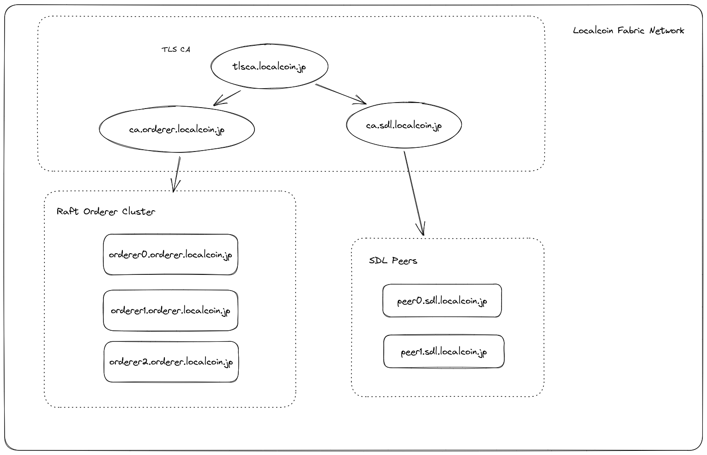

# Port 説明



| 名称 | URL と Port                        |
| ---- | ---------------------------------- |
|      | tlsca.localcoin.jp:6054            |
|      | ca.orderer.localcoin.jp:7054       |
|      | ca.sdl.localcoin.jp:8054           |
|      | orderer0.orderer.localcoin.jp:7050 |
|      | orderer1.orderer.localcoin.jp:8050 |
|      | orderer2.orderer.localcoin.jp:9050 |
|      | peer0.sdl.localcoin.jp:7051~7052   |
|      | peer1.sdl.localcoin.jp:8051~8052   |
|      | couchdb.sdl.localcoin.jp:5984      |

`/etc/hosts`

```ini
172.1.0.10 tlsca.localcoin.jp
172.1.0.11 ca.orderer.localcoin.jp
172.1.0.12 ca.sdl.localcoin.jp
172.1.0.20 orderer0.orderer.localcoin.jp
172.1.0.22 orderer2.orderer.localcoin.jp
172.1.0.21 orderer1.orderer.localcoin.jp
172.1.0.30 peer0.sdl.localcoin.jp
172.1.0.31 peer1.sdl.localcoin.jp
172.1.0.100 couchdb.localcoin.jp
172.1.0.1 files.localcoin.jp
```
